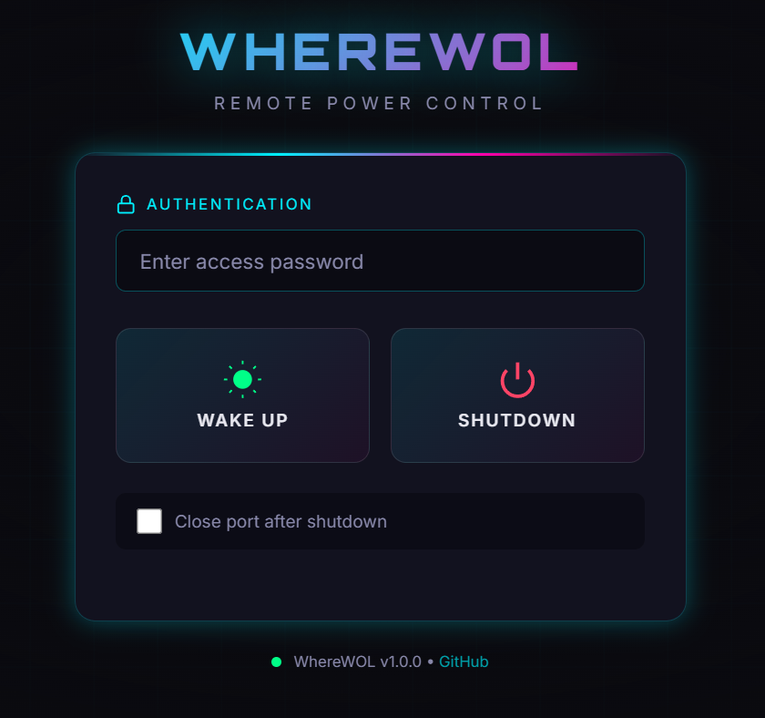

# WhereWOL

> **Secure remote Wake-on-LAN and shutdown controller with RSA authentication.**

Wake up or shut down your PC from anywhere using signed commands. Perfect for home servers, gaming rigs, or any machine you need to control remotely.


<p align="center">
  
</p>

---

## Features

- **RSA-2048 Signed Commands** – Shutdown requires cryptographic authentication
- **Wake-on-LAN Support** – Send magic packets to wake your PC
- **Modern Web Interface** – Dark-themed responsive control panel
- **Single-File CLI** – All functionality in one Python file
- **Security First** – No hardcoded credentials, env-based configuration
- **Mobile Friendly** – Control your PC from your phone

---

## Quick Start

### 1. Install Dependencies

```bash
# Clone the repository
git clone https://github.com/yourusername/wherewol.git
cd wherewol

# Install dependencies
pip install -r requirements.txt
```

### 2. Generate Keys

```bash
python wherewol.py keygen
```

This creates an RSA key pair in the `./keys/` directory:
- `private.pem` – Keep this SECRET on your controller machine
- `public.pem` – Copy this to the target PC

### 3. Start the Agent (on target PC)

```bash
python wherewol.py agent --mac AA:BB:CC:DD:EE:FF --port 5000
```

Replace `AA:BB:CC:DD:EE:FF` with your PC's actual MAC address.

### 4. Control Your PC

**Option A: Command Line**
```bash
# Wake up the PC
python wherewol.py wake --target http://192.168.0.50:5000

# Shut down the PC
python wherewol.py shutdown --target http://192.168.0.50:5000
```

**Option B: Web Interface**
```bash
# Set a password
export WHEREWOL_PASSWORD="your-secure-password"

# Start the web UI
python wherewol.py webui --target http://192.168.0.50:5000 --port 5050
```

Then open `http://localhost:5050` in your browser.

---

## Commands

| Command | Description |
|---------|-------------|
| `keygen` | Generate RSA-2048 key pair for authentication |
| `agent` | Start the agent server on target PC |
| `wake` | Send Wake-on-LAN magic packet |
| `shutdown` | Send signed shutdown command |
| `webui` | Start the web control panel |

### Command Details

```bash
# Generate keys (run once)
python wherewol.py keygen [--keys-dir ./keys] [--force]

# Start agent on target PC
python wherewol.py agent \
    --mac AA:BB:CC:DD:EE:FF \
    --port 5000 \
    --public-key ./keys/public.pem \
    --shutdown-delay 5

# Wake the PC
python wherewol.py wake --target http://192.168.0.50:5000

# Shutdown the PC
python wherewol.py shutdown \
    --target http://192.168.0.50:5000 \
    --private-key ./keys/private.pem \
    [--close-port]

# Start web UI
python wherewol.py webui \
    --target http://192.168.0.50:5000 \
    --port 5050 \
    --private-key ./keys/private.pem \
    --password "your-password"  # or use WHEREWOL_PASSWORD env var
```

---

## Remote Access

WhereWOL is designed for **local network (LAN)** use by default. For remote access from the internet, we recommend using a VPN.

### Recommended: VPN Access (Tested)

The most secure and reliable approach. WhereWOL works great over VPN:

- **Tailscale** – Zero-config mesh VPN, easiest to set up
- **WireGuard** – Fast, modern VPN protocol
- **OpenVPN** – Traditional VPN solution

Simply install the VPN client on your controller device (phone/laptop) and connect to your home network. Then use WhereWOL as if you were on LAN.

### Alternative: Reverse Proxy

Use a secure tunnel service (more complex setup):
- **Cloudflare Tunnel** – Free, secure tunneling
- **ngrok** – Quick testing and development

### Not Recommended: Port Forwarding

Forward port 5000 on your router to the target PC. **Security risk** – exposes your agent directly to the internet.

### Need Remote Desktop?

WhereWOL only controls power (wake/shutdown). For remote desktop access, use:
- **AnyDesk** – Cross-platform, easy to use
- **Parsec** – Low latency, great for gaming
- **RDP** – Built-in Windows remote desktop

**Typical workflow:** Wake PC with WhereWOL, then connect with AnyDesk.

---

## Security Model

WhereWOL uses **asymmetric cryptography** for secure shutdown commands:

```
+------------------+                      +------------------+
|   Controller     |                      |   Target PC      |
|  (your phone/    |    Signed Command    |   (Agent)        |
|   laptop)        | ------------------->  |                  |
|                  |                      |                  |
| [Private Key]    |                      | [Public Key]     |
|  (secret)        |                      |  (shared)        |
+------------------+                      +------------------+
```

### How it works:

1. **Key Generation**: You create an RSA-2048 key pair
2. **Key Distribution**: Private key stays with you, public key goes to target PC
3. **Signing**: Shutdown commands are signed with your private key
4. **Verification**: Agent verifies the signature using the public key
5. **Execution**: Only valid signatures trigger shutdown

### Why is this secure?

- **No shared secrets** – Private key never leaves your control
- **Tamper-proof** – Commands cannot be forged without the private key
- **Replay resistant** – Even if network traffic is captured, attackers can't modify commands
- **WOL is intentionally open** – Waking up a PC is not destructive

---

## Architecture

```
wherewol/
├── wherewol.py          # Main CLI application
├── keys/                # RSA keys (gitignored)
│   ├── private.pem      # Controller side (SECRET)
│   └── public.pem       # Agent side (can be shared)
├── config.example.yaml  # Configuration example
├── requirements.txt     # Python dependencies
├── pyproject.toml       # Package configuration
└── LICENSE              # MIT License
```

### Components

| Component | Role | Runs On |
|-----------|------|---------|
| **Agent** | Listens for WOL/shutdown commands | Target PC |
| **Controller** | Sends signed commands (CLI or WebUI) | Your device |
| **Web UI** | Browser-based control panel | Your device |

---

## Configuration

### Environment Variables

| Variable | Description |
|----------|-------------|
| `WHEREWOL_PASSWORD` | Password for web UI authentication |

### Finding Your MAC Address

**Windows:**
```powershell
ipconfig /all
# Look for "Physical Address"
```

**Linux/macOS:**
```bash
ip link show
# or
ifconfig
```

### Enable Wake-on-LAN in BIOS

1. Enter BIOS/UEFI settings
2. Look for "Power Management" or "Wake-on-LAN"
3. Enable "Wake on PCI-E" or similar option
4. Some motherboards require enabling in the OS network adapter settings too

---

## Troubleshooting

### Agent won't start
- Check if the port is already in use: `netstat -an | grep 5000`
- Verify the public key path is correct

### WOL doesn't work
- Ensure WOL is enabled in BIOS
- Check firewall settings (UDP port 9)
- The PC must be connected via Ethernet (WiFi WOL support varies)

### Shutdown command fails with "Invalid signature"
- Verify you're using the matching key pair
- Regenerate keys if needed: `python wherewol.py keygen --force`

### Can't connect to agent
- Check firewall allows TCP port 5000
- Verify the agent is running: `curl http://target:5000/health`

---

## License

MIT License – see [LICENSE](LICENSE) for details.

---

## Contributing

Contributions are welcome! Please feel free to submit a Pull Request.

---

<p align="center">
  Made with care by the WhereWOL team
</p>
