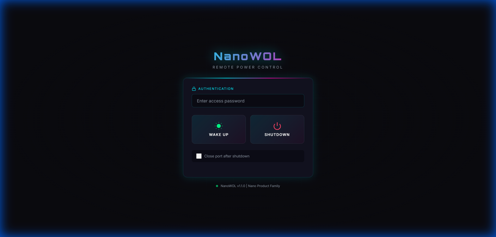

# NanoWOL

**Secure Remote Wake-on-LAN & Shutdown Controller**

NanoWOL is a lightweight CLI/Web tool for remote PC power management with RSA authentication. Part of the **Nano Product Family**.




## Features

* **Secure Authentication:** RSA-2048 signed commands prevent unauthorized shutdowns
* **Wake-on-LAN:** Send magic packets to wake remote machines
* **Remote Shutdown:** Signed shutdown commands with optional port blocking
* **Auto-Start Service:** Agent can run as a system service (starts on boot, no login required)
* **Web UI:** Cyberpunk-styled control panel accessible from any browser
* **CLI Tool:** Full command-line interface for scripting
* **Cross-Platform:** Windows (Task Scheduler), Linux (systemd), macOS (launchd)
* **Modular:** Clean separation into crypto, WOL, agent, service, and webui modules
* **Unit Tested:** 12 tests covering crypto, WOL, and service functionality

> **Note:** Primarily tested on Windows. Linux/macOS should work but feedback welcome!

## Use Cases

### IT Admin / Office Management
Deploy NanoWOL agent on all company workstations. Admin can remotely:
- **Wake** machines before work hours for updates
- **Shutdown** all PCs at end of day (save power!)
- No need to walk through the building

**One-time setup (per machine):**
```powershell
# Run as Administrator on each workstation
python nanowol.py install-service --mac AA:BB:CC:DD:EE:FF
```

**Daily admin scripts:**
```powershell
# wake_all.ps1 - Wake all office PCs
$computers = @(
    "http://192.168.0.101:5000",
    "http://192.168.0.102:5000",
    "http://192.168.0.103:5000"
    # Add all workstation IPs...
)

foreach ($pc in $computers) {
    Write-Host "Waking $pc..."
    python nanowol.py wake --target $pc
}
```

```powershell
# shutdown_all.ps1 - Shutdown all office PCs
foreach ($pc in $computers) {
    Write-Host "Shutting down $pc..."
    python nanowol.py shutdown --target $pc
}
```

**Schedule with Task Scheduler:**
- Wake script at 7:00 AM
- Shutdown script at 6:00 PM

### Home Lab / Server Room
- Wake your NAS or home server remotely before accessing files
- Shutdown after backup is complete
- Control from phone via WebUI

### Remote Work
- Left your home PC on? Shutdown remotely
- Need a file from home? Wake it, grab it, shut it down

### Energy Saving
- Scheduled shutdowns at night via scripts
- Wake only when needed instead of 24/7 operation

## Requirements

* Python 3.8+
* Dependencies: `click`, `flask`, `cryptography`, `requests`

## Installation

```bash
# Clone repository
git clone https://github.com/goAuD/NanoWOL.git
cd NanoWOL

# Install dependencies
pip install -r requirements.txt
```

## Quick Start

### 1. Generate Keys
```bash
python nanowol.py keygen
```

### 2. Install as Service (Recommended)
```bash
# On target PC - installs agent to start on boot (no login required)
python nanowol.py install-service --mac AA:BB:CC:DD:EE:FF
```

### 3. Or Start Agent Manually
```bash
# Copy public.pem to target PC, then:
python nanowol.py agent --mac AA:BB:CC:DD:EE:FF --public-key ./keys/public.pem
```

### 4. Start Web UI (on controller)
```bash
python nanowol.py webui --target http://192.168.0.50:5000
```

### 5. CLI Commands
```bash
# Wake
python nanowol.py wake --target http://192.168.0.50:5000

# Shutdown
python nanowol.py shutdown --target http://192.168.0.50:5000

# Check service status
python nanowol.py service-status
```

## Project Structure (v1.2.0)

```
NanoWOL/
├── nanowol.py         # CLI entry point
├── crypto.py          # RSA key operations
├── wol.py             # Wake-on-LAN logic
├── agent.py           # Agent Flask server
├── webui.py           # Web UI Flask server
├── service.py         # Cross-platform service installation
├── templates/
│   └── index.html     # Cyberpunk web template
├── test_nanowol.py    # Unit tests (12 tests)
└── requirements.txt   # Dependencies
```

## Service Installation

NanoWOL can install itself as a system service to auto-start on boot:

| Platform | Method | Requires Login |
|----------|--------|----------------|
| Windows | Task Scheduler (Boot trigger) | No |
| Linux | systemd user service | No |
| macOS | launchd user agent | No |

```bash
# Install
python nanowol.py install-service --mac AA:BB:CC:DD:EE:FF

# Uninstall
python nanowol.py uninstall-service

# Check status
python nanowol.py service-status
```

## Running Tests

```bash
python test_nanowol.py
# or
python -m pytest test_nanowol.py -v
```

## Security

* RSA-2048 signatures for shutdown commands
* Password-protected Web UI
* Optional firewall port blocking after shutdown
* Self-hosted, no cloud account or external service required

> **Note:** NanoWOL works natively on LAN. For remote access over the internet, use VPN or Tailscale to connect to your network first.

## FAQ

### Why do I need NanoWOL? I can just run `shutdown` on my PC!

Yes, but **you need to be sitting at your PC** to do that. NanoWOL is for **remote** power management:

| Situation | Simple `shutdown` | NanoWOL |
|-----------|-------------------|---------|
| Sitting at your PC | ✅ Works fine | Overkill |
| Want to shut down remotely | ❌ Not possible | ✅ That's the point |
| Want to **turn ON** remotely | ❌ Impossible | ✅ Wake-on-LAN |
| Need secure authentication | ❌ Depends on RDP/SSH | ✅ RSA-2048 signed |

**Real scenarios:**
- Left your home PC running? Shut it down from your phone
- Need a file from home? Wake PC → RDP in → grab file → shut down
- IT admin with 50 office PCs? Script wake/shutdown instead of walking around

### What is Wake-on-LAN (WOL)?

Wake-on-LAN is a hardware feature that allows you to **turn on a completely powered-off PC** by sending a special "magic packet" over the network. The network card stays in low-power mode and listens for this packet even when the PC is off.

**Requirements:**
- WOL enabled in BIOS
- "Wake on Magic Packet" enabled in network adapter settings
- Ethernet connection (WiFi WOL rarely works)
- PC plugged into power

### Why not just use SSH + `shutdown` command?

You could, but:

| Aspect | SSH + shutdown | NanoWOL |
|--------|----------------|---------|
| Can wake PC? | ❌ No | ✅ Yes |
| Needs credentials? | Yes (password/key) | No (RSA signature) |
| Password travels over network? | Yes | No |
| Setup complexity | SSH server + keys | One command |
| Attack surface | Full shell access | Only wake/shutdown |

With SSH, you're giving **full shell access**. With NanoWOL, the agent can **only** wake or shutdown – nothing else.

### Is this a security risk?

**No, it's designed to be secure:**

- Shutdown commands require **RSA-2048 signatures**
- The agent only accepts commands signed with the matching private key
- Your private key **never leaves your controller** – only the public key is on target PCs
- No passwords transmitted over network
- Self-hosted, no cloud account or external service required
- Optional: firewall blocks the port after shutdown

**Worst case scenario:** Someone sends a WOL packet → Your PC turns on. That's it. They can't shut it down without your private key.

### Does Wake-on-LAN work over WiFi?

**Rarely.** Most WiFi adapters disable their radio completely when the PC is off (to save power), so they can't receive the magic packet.

**Recommendation:** Use Ethernet for reliable WOL. This is a hardware limitation, not a NanoWOL issue.

### Can I use this over the internet?

**Not directly** – WOL uses UDP broadcast which doesn't route over the internet. Options:

1. **VPN:** Connect to your home network via VPN, then use NanoWOL normally
2. **Always-on device:** Have a Raspberry Pi or NAS running the agent 24/7, use it to wake other PCs

### What's the typical home use case?

1. **Gaming PC:** Wake it remotely so it's booted up by the time you get home
2. **Energy saving:** Don't run your PC 24/7, wake only when needed
3. **Media server/NAS:** Start on demand, shut down after use
4. **"Oops" moments:** Forgot to turn off your PC? Fix it from anywhere

### What's the typical IT/office use case?

```powershell
# 7:00 AM - Wake all workstations before staff arrives
foreach ($pc in $workstations) { python nanowol.py wake --target $pc }

# 6:00 PM - Shutdown everything (save power!)
foreach ($pc in $workstations) { python nanowol.py shutdown --target $pc }
```

Schedule with Task Scheduler → Zero manual work, automatic energy savings.

## Troubleshooting

### Agent not reachable (Connection Timeout)

**Symptom:** `HTTPConnectionPool... Max retries exceeded`

**Solutions:**
1. **Check agent is running on target PC:**
   ```powershell
   netstat -an | findstr :5000
   # Should show: TCP 0.0.0.0:5000 LISTENING
   ```

2. **Open firewall on target PC (Admin PowerShell):**
   ```powershell
   New-NetFirewallRule -DisplayName "NanoWOL Agent" -Direction Inbound -Protocol TCP -LocalPort 5000 -Action Allow
   ```

3. **Test connectivity from controller:**
   ```powershell
   Test-NetConnection -ComputerName 192.168.0.50 -Port 5000
   ```

### Wake-on-LAN not working

**Checklist:**
- [ ] BIOS: Wake-on-LAN enabled
- [ ] Network adapter: "Wake on Magic Packet" enabled (Device Manager → Network Adapter → Properties → Power Management)
- [ ] PC plugged into power (not battery)
- [ ] Ethernet cable connected (WiFi WOL rarely works)
- [ ] Same LAN/subnet as controller

**Test WOL manually:**
```powershell
python nanowol.py wake --target http://192.168.0.50:5000
```

### Service not starting after boot

**Check service status:**
```powershell
python nanowol.py service-status
schtasks /query /tn "NanoWOL-Agent" /v
```

**Manually start the task:**
```powershell
schtasks /run /tn "NanoWOL-Agent"
```

**Reinstall with admin mode (starts before login):**
```powershell
# Run as Administrator
python nanowol.py install-service --mac AA:BB:CC:DD:EE:FF --admin
```

### Unicode/Encoding errors on non-English Windows

Upgrade to latest version - encoding issues have been fixed for Hungarian and other non-English Windows systems.

## Part of Nano Product Family

This tool uses the [Nano Design System](https://github.com/goAuD/NanoServer/blob/main/DESIGN_SYSTEM.md) for consistent styling across lightweight developer tools.

## License

MIT License

