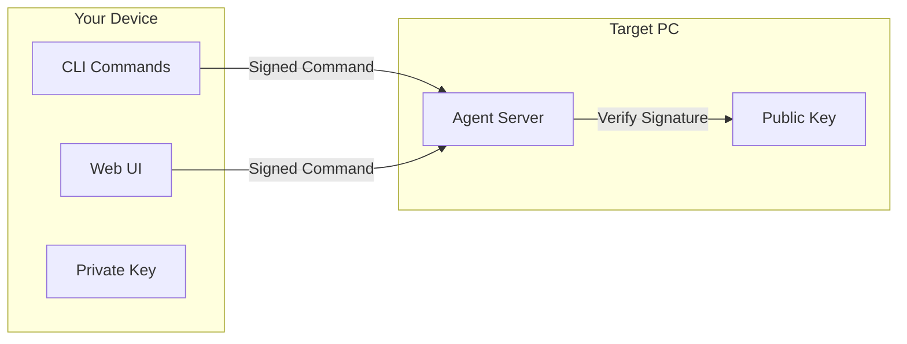
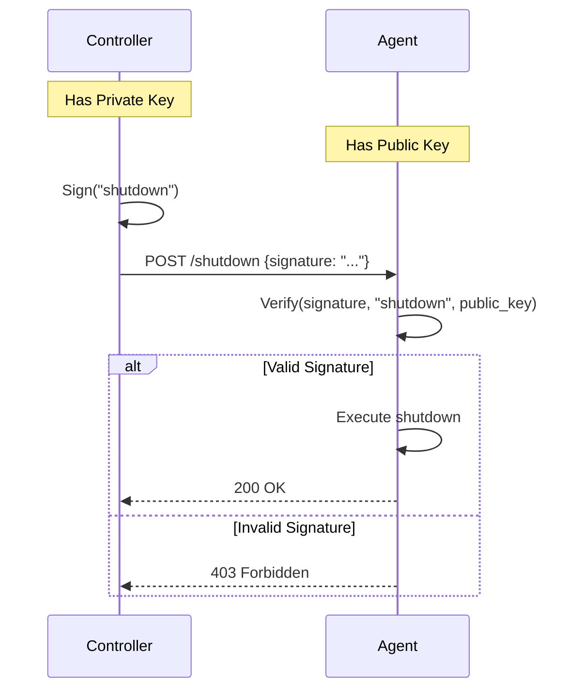
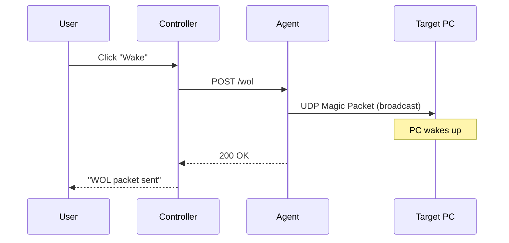
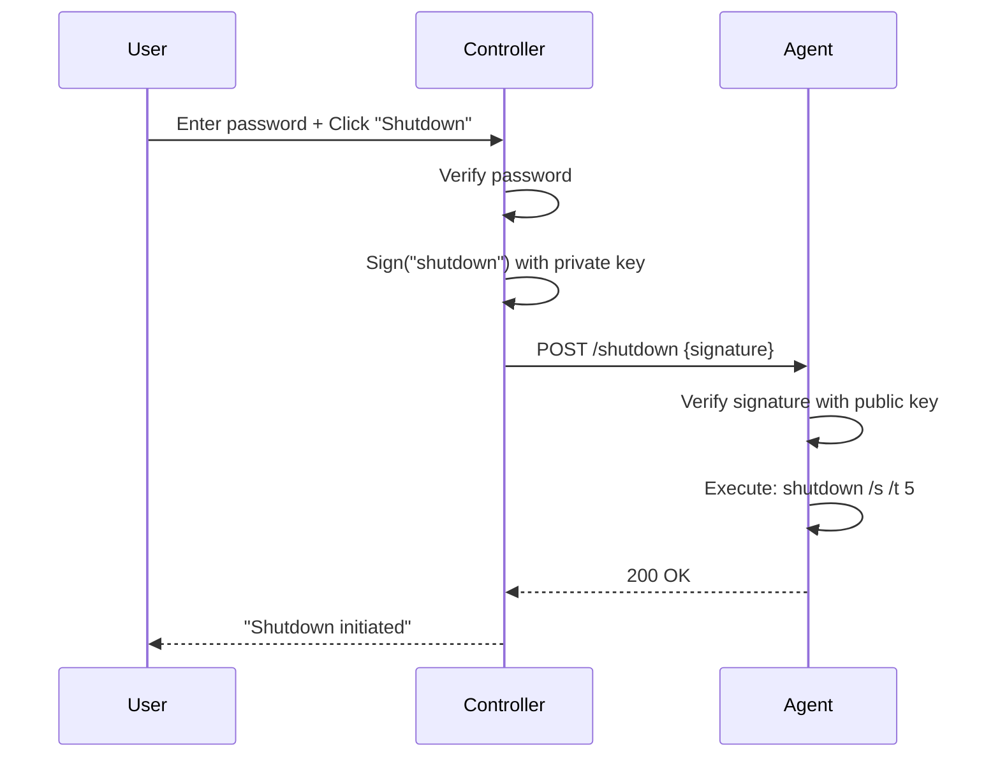

# NanoWOL Architecture

This document describes the technical architecture of NanoWOL.

---

## Overview

NanoWOL is a secure remote power management tool consisting of two main components:

1. **Agent** – A lightweight Flask server running on the target PC
2. **Controller** – CLI commands or Web UI for sending commands



---

## Components

### 1. Agent Server

The agent runs on the target PC and exposes a simple REST API:

| Endpoint | Method | Auth Required | Description |
|----------|--------|---------------|-------------|
| `/health` | GET | No | Health check |
| `/wol` | POST | No | Send WOL packet |
| `/shutdown` | POST | **Yes (RSA)** | Initiate shutdown |

**Security Note:** The `/wol` endpoint is intentionally unauthenticated because:
- WOL is not destructive (worst case: PC turns on)
- The agent can wake OTHER machines on the network
- Useful for chained wake-up scenarios

### 2. Controller

The controller can be either:

- **CLI** – Direct command-line tool
- **Web UI** – Browser-based dashboard

Both use the same underlying signing logic.

---

## Security Architecture

### RSA-2048 Signature Flow



### Key Management

```
┌──────────────────────────────────────────────────────────────┐
│                     KEY GENERATION                            │
│   $ python NanoWOL.py keygen                                │
│                        │                                      │
│            ┌───────────┴───────────┐                         │
│            ▼                       ▼                         │
│     ┌─────────────┐         ┌─────────────┐                  │
│     │ private.pem │         │ public.pem  │                  │
│     │   (SECRET)  │         │  (shareable)│                  │
│     └──────┬──────┘         └──────┬──────┘                  │
│            │                       │                         │
│            ▼                       ▼                         │
│     ┌─────────────┐         ┌─────────────┐                  │
│     │ Controller  │         │   Agent     │                  │
│     │  (CLI/Web)  │         │ (Target PC) │                  │
│     └─────────────┘         └─────────────┘                  │
└──────────────────────────────────────────────────────────────┘
```

### Why RSA over Shared Secret?

| Aspect | Shared Secret (HMAC) | RSA Signatures |
|--------|---------------------|----------------|
| Key Distribution | Risk: secret travels | Safe: only public key travels |
| Compromise Impact | Full system compromised | Only one side affected |
| Key Rotation | Requires coordination | Public key can be freely updated |
| Implementation | Simpler | Slightly more complex |

---

## Data Flow

### Wake-on-LAN Flow



### Shutdown Flow



---

## Network Requirements

### Ports

| Port | Protocol | Direction | Purpose |
|------|----------|-----------|---------|
| 5000 | TCP | Inbound | Agent server |
| 5050 | TCP | Inbound | Web UI |
| 9 | UDP | Outbound | WOL magic packets |

### Firewall Rules (Windows)

```powershell
# Allow agent port
netsh advfirewall firewall add rule name="NanoWOL Agent" dir=in action=allow protocol=TCP localport=5000

# Optional: Block after shutdown
netsh advfirewall firewall add rule name="BlockNanoWOL" dir=in action=block protocol=TCP localport=5000
```

---

## Deployment Scenarios

### Scenario 1: Same Network

```
┌─────────────────────────────────────────────────────┐
│                   Home Network                       │
│                                                     │
│   Phone (WebUI)  ──────────▶  Gaming PC         │
│   192.168.0.10                   192.168.0.50       │
│                                  (Agent)            │
└─────────────────────────────────────────────────────┘
```

### Scenario 2: Remote Access (via VPN)

```
┌─────────────────┐         ┌─────────────────────────┐
│   Remote        │   VPN   │     Home Network        │
│   Location      │────────▶│                         │
│                 │         │   Target PC           │
│   Controller    │         │   192.168.0.50          │
└─────────────────┘         └─────────────────────────┘
```

### Scenario 3: Chain Wake (Multiple PCs)

```
┌─────────────────────────────────────────────────────────────┐
│                    Home Network                              │
│                                                             │
│   Phone ────▶ NAS (always on) ────▶ Gaming PC      │
│                     └─ Agent A              └─ Agent B       │
│                                                             │
│   1. Phone wakes Gaming PC via NAS agent                    │
│   2. NAS sends WOL to Gaming PC                             │
└─────────────────────────────────────────────────────────────┘
```

---

## File Structure

```
NanoWOL/
├── NanoWOL.py          # Single-file application
│   ├── CLI Commands     # keygen, agent, wake, shutdown, webui
│   ├── Crypto Utils     # RSA key generation, signing, verification
│   ├── WOL Functions    # Magic packet creation and sending
│   ├── Agent Server     # Flask app for target PC
│   └── WebUI Server     # Flask app with embedded template
│
├── keys/                # Generated keys (gitignored)
│   ├── private.pem      # RSA private key
│   └── public.pem       # RSA public key
│
├── docs/
│   └── architecture.md  # This file
│
├── config.example.yaml  # Configuration example
├── requirements.txt     # Python dependencies
├── pyproject.toml       # Package configuration
├── LICENSE              # MIT License
└── README.md            # User documentation
```

---

## Future Improvements

- [ ] Time-based one-time tokens
- [ ] Multiple target support
- [ ] Status monitoring (is PC on?)
- [ ] Scheduled wake/shutdown
- [ ] Docker deployment
- [ ] systemd service file

